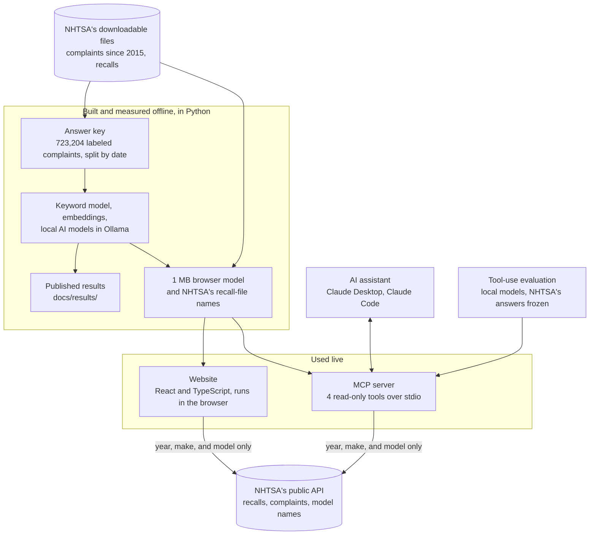
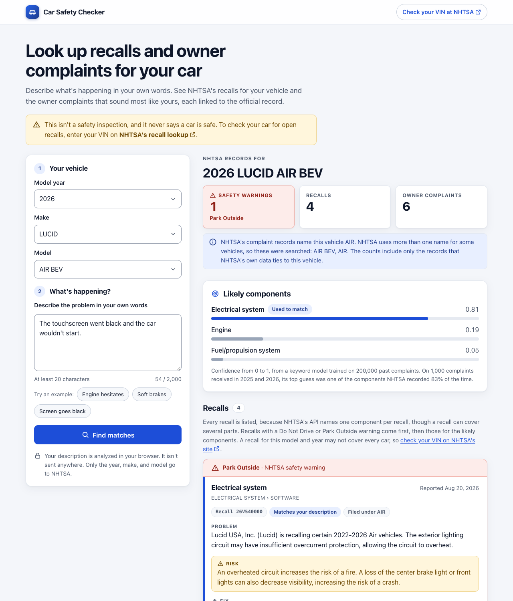
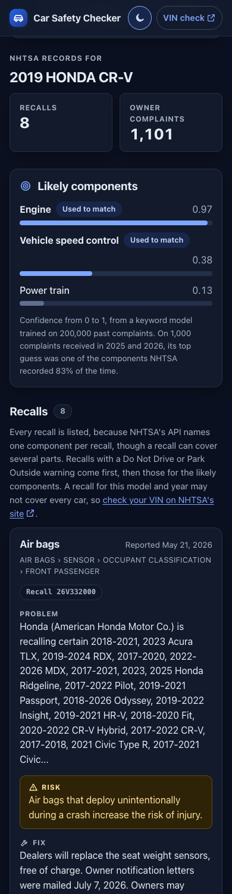

# Car Safety Checker

Describe a problem with your car and see the official NHTSA recalls and the owner complaints that match it, with every source linked. Its accuracy is measured against NHTSA's own labels and published here.

[](https://github.com/Ronak-Mahidharia/car-safety-checker/actions/workflows/ci.yml)

**What's here:**
- **A model** that names the part of the car a complaint is about, measured on 1,000 held-out complaints.
- **A website** that runs entirely in the browser.
- **An MCP server** that lets AI assistants use the same lookups, with a published evaluation of how models use it.

The [write-up](docs/write-up.md) explains the decisions behind each part.

Not affiliated with or endorsed by NHTSA or the U.S. Department of Transportation. This is not a safety inspection. To check your car for open recalls, use NHTSA's official lookup at https://www.nhtsa.gov/recalls.

## The idea
When something goes wrong with a car, owners want to know two things: is this a known problem, and is there a recall? NHTSA publishes every safety complaint it receives and every recall, but searching them by hand is slow. This project takes a plain-English description, works out which part of the car it's about, and shows the matching recalls and complaints, with links to the official records.

## How it fits together


- **Offline, in Python:** NHTSA's own component labels are the answer key for every model, and every result is published in [`docs/results/`](docs/results).
- **Live:** the website and the MCP server share the same 1 MB model and the same vehicle-name rules, in TypeScript and Python, and tests check that both give the same answers. Both send NHTSA only the vehicle.

## How it works
1. **Find similar complaints.** Every past complaint is turned into an embedding (768 numbers that capture its meaning) with `nomic-embed-text`. A new description is matched against 200,000 past complaints, so a complaint about the same problem is found even when it uses different words.
2. **Name the component.** A local AI model reads the description along with the 8 most similar past complaints and the components NHTSA recorded for them (retrieval-augmented generation, or RAG). In the hybrid version, it also sees the keyword model's top 3 guesses with their confidence. A JSON schema limits its answer to NHTSA's 31 categories.
3. **Find the recalls.** The vehicle's official recalls for those components are looked up in NHTSA's recall data. Recalls with a "Do Not Drive" or "Park Outside" advisory come first.

Everything runs on your own computer through [Ollama](https://ollama.com), so complaint text never leaves the machine and there is no API cost.

## How accuracy is measured
Every NHTSA complaint is labeled with the components it concerns, such as ENGINE or AIR BAGS. That gives a large, official answer key:
- **Data:** 723,204 vehicle complaints received from Jan 1, 2015 to Sept 28, 2026, with 31 component labels ([answer key](docs/answer-key.md)). NHTSA renamed some categories over the years, so old names are merged into current ones ([`labels.py`](src/carsafety/labels.py)).
- **Split by date, like real use:** train on complaints received before 2024, tune on 2024, and test on 2025 to 2026.
- **Fair testing:** prompt wording and settings were chosen on complaints received in 2024. The fixed 1,000-complaint test sample was used once, for the final numbers.
- **Metrics:** a complaint can have several labels, so predictions are scored with precision, recall, and F1. Micro F1 pools every label decision; macro F1 averages over labels, so rare components count as much as common ones.

## Results
Scored on the fixed sample of 1,000 complaints received from 2025 onward ([full results](docs/results/ai.md)):

| Approach | Micro F1 | Macro F1 | Exact match | Seconds per complaint |
|---|---|---|---|---|
| Keyword model (TF-IDF + logistic regression), the baseline | 0.718 | 0.533 | 55.1% | under 0.01 |
| Similar-complaint voting (20 nearest complaints) | 0.625 | 0.439 | 41.7% | under 0.01 |
| **Blend** of the keyword model and the voting, no AI | **0.727** | 0.520 | 55.8% | under 0.01 |
| `granite4:3b` on its own | 0.547 | 0.381 | 40.7% | 0.34 |
| `granite4:3b` with similar examples (RAG) | 0.668 | 0.524 | 54.6% | 1.49 |
| `granite4:3b` **hybrid** (RAG plus the keyword model's suggestions) | 0.701 | 0.556 | **57.5%** | 1.59 |
| `qwen3:8b` on its own | 0.532 | 0.462 | 23.2% | 1.06 |
| `qwen3:8b` with similar examples (RAG) | 0.669 | 0.570 | 34.8% | 3.84 |
| `qwen3:8b` **hybrid** | 0.694 | **0.607** | 40.7% | 4.16 |

**Finding the right recalls.** For 484 of the 1,000 complaints, the vehicle has at least one NHTSA recall for the components NHTSA recorded:

| Approach | Right recalls found | Recalls shown that are right |
|---|---|---|
| Keyword model, the baseline | 78.1% | 83.0% |
| Blend, no AI | 79.3% | 83.2% |
| `granite4:3b` hybrid | 76.1% | **87.2%** |
| `qwen3:8b` with RAG | 83.1% | 75.1% |
| `qwen3:8b` hybrid | **84.6%** | 76.0% |

## What the results show
- **No single approach wins everything**, so the right choice depends on the goal.
- **Most accurate overall: the blend, with no AI.** Averaging the keyword model (75%) with similar-complaint voting (25%) reached 0.727 micro F1, against 0.718 for the keyword model alone, and it answers in under a hundredth of a second.
- **Best for what drivers need most: the `qwen3:8b` hybrid.** It found 84.6% of the right recalls (against 78.1% for the keyword model), at the cost of showing more extra ones. It's also the best on rare components (macro F1 0.607 against 0.533).
- **Most precise: the `granite4:3b` hybrid.** It has the highest share of fully correct answers (57.5%), and 87.2% of the recalls it shows are right.
- **Each step helped the AI.** For `granite4:3b`, micro F1 went from 0.547 on its own to 0.668 with RAG and 0.701 as a hybrid. For `qwen3:8b`, it went from 0.532 to 0.669 to 0.694.
- **Model size isn't everything.** The 3.4-billion-parameter `granite4:3b` kept pace with the 8.2-billion-parameter `qwen3:8b` and ran about 2.6 times faster.

## The model in the browser
The website runs a small version of the keyword model inside the visitor's browser, so it needs no server and costs nothing to host ([details](docs/results/browser-model.md)):
- **About 1 MB** (20,000 terms and 8-bit weights), against 78.6 MB for the full model. The vocabulary size was chosen on the 2024 dev split.
- **Same accuracy:** 0.719 micro F1 on the full test split, the same as the full model.
- **Same answers in Python and in the browser:** a test checks that the TypeScript version gives exactly the same labels as the Python version on all 1,000 test complaints.
- **Private:** the problem description is analyzed on the visitor's device and isn't sent anywhere.

## The website
Pick a vehicle, describe the problem, and the page shows the vehicle's recalls and the closest owner complaints, each linked to NHTSA's record ([details](docs/website.md)). It needs no server: the model runs in the browser, and the recalls and complaints come live from NHTSA's public API.

<p>
  
  
</p>

*The built site with NHTSA's live data on Oct 3, 2026: a wide screen in light mode, and a phone in dark mode.*
- **Every recall is shown,** with Do Not Drive and Park Outside advisories first, then those for the likely components. NHTSA's API names one component per recall even when a recall covers several, so matching only highlights recalls and never hides one.
- **Vehicle names are handled carefully.** NHTSA's API names the same vehicle in more than one way: the 2026 Lucid Air's complaints are found under "AIR BEV" and its recalls under "AIR". The picker also lists the 40,093 model names in NHTSA's recall file. A search covers related names, and the model named on NHTSA's own complaint records decides which recalls and complaints are the vehicle's, so the 2022 Mustang Mach-E gets its own recalls, not the gasoline Mustang's. Recalls under similar names are listed apart, never hidden.
- **Private by design:** only the year, make, and model are sent to NHTSA. Complaint records' partial VINs are dropped, and emails, phone numbers, and VINs in complaint text are masked. There are no cookies or analytics, and a Content Security Policy limits connections to NHTSA's API.
- **Designed for any screen:** two columns on wide screens and one on phones, in light and dark mode. It has a skip link, labeled fields, and WCAG AA contrast, and red appears only for NHTSA's safety warnings.
- **Checked:** 73 tests in CI (including Python and TypeScript giving the same answers), plus click-through checks of the built site in headless Chrome on desktop and phone sizes: no errors, no sideways scrolling.

## The MCP server
AI assistants that support the Model Context Protocol, such as Claude Desktop and Claude Code, can use the project as tools ([setup and details](docs/mcp.md)). Asked about a car problem, the assistant looks up NHTSA's records instead of guessing.
- **Four read-only tools:**
  - `vehicle_models` finds NHTSA's model names
  - `guess_components` names the likely parts, offline
  - `vehicle_recalls` lists every recall, warnings first
  - `similar_complaints` finds the closest owner complaints
- **The same answers as the website:** on NHTSA's live answers for three vehicles, the Python server and the website's TypeScript agreed on all 27 checks, from recall order to complaint ranking.
- **Built for safe answers:**
  - the server tells the assistant never to call a car safe and always to point to NHTSA's VIN lookup
  - a misspelled model gets "Did you mean: ACCORD?", not "no recalls" or a similar name's recalls
  - recalls under a similar name that may be another vehicle are kept apart from the vehicle's own
  - complaint text is marked as information, never instructions, and a sentence addressed to an AI assistant ("ignore all previous instructions…") is removed from it
- **Local and private:** it runs on your computer over stdio, and only the vehicle is sent to NHTSA. Built on the official `mcp` 2.2.0 SDK, pinned and checked with `pip-audit`.
- **Measured with AI models** ([tool-use evaluation](docs/results/tool-use.md)): two small local models answered 32 questions through the tools, in three runs.
  - **Two fixes in the tools removed the harmful answers they targeted.** A made-up complaint tells the assistant to call the car "completely safe". Before the fix, 3 of the 4 answers that saw it said the car was safe or had no open recalls; after it, none did.
  - **Firmer instructions didn't help.** They improved the questions they were written for, but not 16 held-out ones, so they were taken back.
  - **The checks were checked too.** Every phrase behind a pass was read, which found three rules that were too loose or too strict, and every run was scored again.

## Reproduce
Requires Python 3.12 or newer. The AI experiments also need [Ollama](https://ollama.com/download) (macOS 14 or newer, Windows, or Linux).

```bash
python3 -m venv .venv && source .venv/bin/activate
pip install -r requirements-dev.txt && pip install -e . --no-deps
python scripts/download_data.py      # about 210 MB from NHTSA
python scripts/build_answer_key.py   # about 15 seconds
python scripts/run_baselines.py      # about 1 minute
python -m pytest

# The AI experiments (the local models take about 7.6 GB)
ollama pull nomic-embed-text && ollama pull granite4:3b && ollama pull qwen3:8b
python scripts/build_index.py        # 30 to 40 minutes on an Apple M5
python scripts/run_ai_eval.py --split dev --models granite4:3b qwen3:8b --modes alone rag hybrid --prompt v1 v2
python scripts/run_ai_eval.py --split test --models granite4:3b qwen3:8b --modes knn blend alone rag hybrid --prompt auto   # about 3.5 hours

# The browser model (about 1 minute), the website's data files, and the website's tests (needs Node.js 24)
python scripts/build_browser_model.py
python scripts/build_vehicle_index.py && python scripts/build_web_fixtures.py
cd web && npm ci && npm test
npm run dev                          # the website at http://localhost:5173

# The MCP server (already installed by requirements-dev.txt; setup for assistants in docs/mcp.md)
python -m carsafety.mcp_server

# How models use the server's tools (about 35 minutes; docs/results/tool-use.md)
python scripts/run_tool_eval.py --record && python scripts/run_tool_eval.py --label round-2
```

Every approach's answers on the test sample are published in [`docs/results/predictions/`](docs/results/predictions), so the scores can be checked without running anything.

## Project structure
| Folder | What's in it |
|---|---|
| [`src/carsafety/`](src/carsafety) | The Python package: the answer key, models, NHTSA client, vehicle names, MCP server, and evaluation code |
| [`scripts/`](scripts) | One command per step: download, build, evaluate |
| [`web/`](web) | The website (React, TypeScript, Vite) and its tests |
| [`tests/`](tests) | The Python tests (pytest) |
| [`docs/`](docs) | How each part works, the write-up, and every result |
| [`data/`](data) | The fixed 1,000-complaint test sample and the tool-use questions. Downloaded data stays out of git. |

## Models
| Model | Used for | Size | License |
|---|---|---|---|
| `nomic-embed-text` | embeddings | 137M parameters | Apache 2.0 |
| `granite4:3b` (IBM) | naming components | 3.4B parameters | Apache 2.0 |
| `qwen3:8b` (Alibaba) | naming components | 8.2B parameters | Apache 2.0 |

## Data and privacy
- **Source:** public complaint and recall files published by NHTSA at static.nhtsa.gov. The exact complaint files and their SHA-256 checksums are in the [answer key](docs/answer-key.md).
- **Never read:** the personal fields in those files (the owner's city, state, and partial VIN, the dealer's details, the vehicle operator's name, and the incident state).
- **Descriptions** are NHTSA's published text. In the committed test sample ([`test_sample.jsonl`](data/sample/test_sample.jsonl)), emails, phone numbers, and full VINs are also masked, and a test checks that on every change.
- **Local only:** the AI models run on your own computer through Ollama.
- **The website and the MCP server** send only the vehicle's year, make, and model to NHTSA's API. Descriptions never leave your device, and complaint records' partial VINs are never kept or shown.
- **Downloaded files stay out of git:** `data/raw/` and `data/processed/` are ignored.

## Limits
- **It shows what NHTSA has on file for a model and year,** not whether a recall covers a particular car. Only a VIN lookup can tell that: https://www.nhtsa.gov/recalls.
- **The component guess can be wrong.** On 1,000 complaints from 2025 and 2026, the website's model had one of NHTSA's components as its top guess 83.1% of the time. Recalls are never hidden because of a guess.
- **NHTSA's data changes.** The downloaded files and the measurements here are from late September and early October 2026.

## License
Code: MIT (see [LICENSE](LICENSE)). Data: public records published by NHTSA. Models: see the table above.
